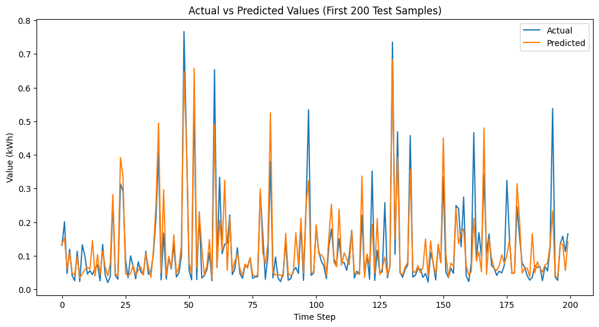

# 🔌 Energy Consumption Forecasting using LSTM

This project is a time series forecasting model that predicts hourly energy consumption using LSTM (Long Short-Term Memory) neural networks. The goal is to explore how historical usage patterns, day-of-week, and contextual notes (like weekends or lockdowns) can help forecast future electricity demand.

## 📌 Problem Statement

Forecasting energy demand helps in:
- Better resource allocation
- Reducing power shortages
- Planning maintenance
- Managing grid load during holidays or lockdowns

---

## 📊 Dataset

- **Columns Used**:  
  - `Value (kWh)` – Actual energy usage
  - `day_of_week` – Day mapped as 0 (Monday) to 6 (Sunday)
  - `notes` – Categorical labels such as 'weekend', 'vacation', 'COVID_lockdown'
  
- **Preprocessing Steps**:
  - Label Encoding of `notes`
  - MinMax Normalization of `Value (kWh)`
  - Sliding Window Technique (window size = 24) to feed time-series sequences to the model

---

## 🧠 Model Architecture

- **Model Type**: LSTM (Recurrent Neural Network)
- **Input Shape**: `(24, 3)` → 24 time steps, 3 features (kWh, day_of_week, notes_encoded)
- **Layers**:
  - LSTM (50 units, relu activation)
  - Dense (1 output neuron for kWh prediction)
- **Loss Function**: Mean Squared Error (MSE)
- **Optimizer**: Adam
- **Epochs**: 10
- **Batch Size**: 32

---

## ✅ Evaluation Metrics

| Metric        | Value         |
|---------------|---------------|
| R² Score      | 0.7427        |
| MAE           | 0.03978       |
| MSE           | 0.00507       |
| MAPE          | 40.85%        |

---

## 📈 Results

- The model successfully captures energy usage trends with reasonably good accuracy using simple feature like`day_of_week` and `notes`.

---

## 💡 Future Improvements

- Add external features like temperature, holidays, or seasonality
- Try other models like GRU, BiLSTM, or Transformers
- Hyperparameter tuning with Optuna or GridSearchCV
- Real-time data streaming with model deployment

---

